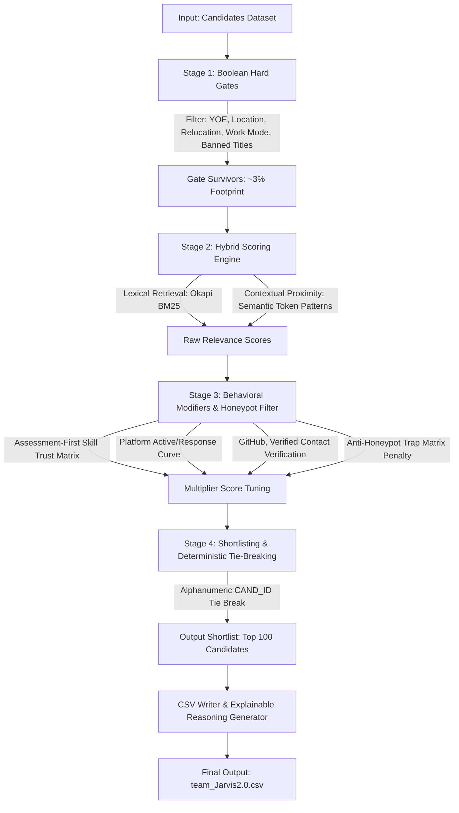

# Redrob Hybrid Ranker

CPU-only submission ranker for 
the Redrob Intelligent Candidate Discovery & Ranking Challenge.

## Files

- `rank_candidates.py` generates the submission CSV.
- `team_Jarvis2.0.csv` is the generated and validator-passing submission file.
- `validate_submission.py` is the official CSV format validator.
- `signal_calibration.py` holds empirically tuned multiplier constants (see below).
- `analyze_signals.py` reproduces correlation/distribution analysis on the surviving pool.
- `docs/SIGNAL_CALIBRATION.md` is the judge-facing calibration report.
- `data/candidates.jsonl` is the candidate dataset used by the ranker.
- `data/sample_candidates.jsonl` is a lightweight sample dataset (2969 candidates) designed so that exactly 100 candidates survive the Stage 1 gates, ensuring the format validator passes.
- `sandbox.ipynb` is a runnable Jupyter Notebook designed to run end-to-end in Google Colab.
- `submission_metadata.yaml` contains metadata for the portal and Stage 3 review.

## Reproduce

To reproduce our official submission using the pure Heuristic ranker (which avoids GBDT circularity and BM25 lexical dominance, and is our primary submitted system):
```bash
python rank_candidates.py --out team_Jarvis2.0.csv
python validate_submission.py team_Jarvis2.0.csv
python analyze_signals.py   # reproduce empirical calibration stats
```

## Alternative Run (GBDT LambdaMART Combiner)

The pipeline also supports the machine-learned GBDT ranker trained on heuristic targets (distilled rules):
```bash
python rank_candidates.py --use-learned-combiner --out team_Jarvis2.0.csv
python validate_submission.py team_Jarvis2.0.csv
python analyze_signals.py   # reproduce empirical calibration stats
```

### Advanced Custom Runs & Embedding Regeneration
If you run the pipeline on custom/unseen datasets or wish to regenerate the Cross-Encoder scores from scratch:
1. Prepare your environment:
   ```bash
   pip install -r requirements.txt
   ```
2. Run the Cross-Encoder scorer locally on CPU (uses `models/ms-marco-MiniLM-L-12-v2`):
   ```bash
   python generate_crossencoder_scores.py
   ```
3. Run the ranker. If a candidate is not found in the precomputed scores, the pipeline will automatically fall back to computing the embedding dynamically:
   ```bash
   python rank_candidates.py --embedding-model models/ms-marco-MiniLM-L-6-v2
   ```
4. If you wish to disable the semantic signal entirely and run in lexical-only mode:
   ```bash
   python rank_candidates.py --no-embeddings
   ```

## Sandbox (Google Colab)

A hosted, runnable sandbox of the ranking system is available on Google Colab:
[](https://colab.research.google.com/github/SaiKarthikMothe/Redrob_Hybrid_Ranker/blob/main/sandbox.ipynb)

By default, the Google Colab environment is configured to clone this repository, set up the environment, and run the pipeline end-to-end.

---

## System Architecture

The ranking engine employs a multi-stage pipeline designed for execution speed, low memory footprints on CPU-only hosts, and robust signal integration.



### Pipeline Details:

1. **Stage 1 (Boolean Hard Gates):** Instantly discards non-fits based on strict constraints (Years of Experience between 4 and 13, onsite preference or willingness to relocate to Pune/Noida, non-technical title exclusions, completeness score $\ge 50\%$, and blacklist checks).
2. **Stage 2 (Hybrid Scoring Engine):**
   * **Okapi BM25 (23% Weight):** Computes lexical relevance scores against target JD keywords using corpus-wide statistics.
   * **Cross-Encoder L-12 Semantic Scoring (50% Weight):** The dominant semantic signal. Uses a local `ms-marco-MiniLM-L-12-v2` transformer model to compute deep contextual relevance (falls back to a lexical/breadth-only mixture if the model weights are unavailable).
   * **Career History Co-Occurrence (27% Weight):** Awards structured co-occurrence relevance based on historical role titles and action verbs (*"built"*, *"scaled"*, *"optimized"*) matching the candidate's career progression.
   * **Headline-aware matching:** Ingests candidate profile headlines directly into the lexical and semantic paths to let explicit stack alignment guide the score.
3. **Stage 3 (Behavioral Modifiers & Honeypot Check):**
   * **Heuristic Multiplier Stack:** Applies activity decay (sigmoid centered on median inactivity of 88 days), recruiter response rates, recruiter response time, operational interview completion rate, GitHub activity band, verified contact verification, low offer acceptance rate penalties, and an assessment-first skill trust matrix.
   * **Industry Origin Calibrations:** Rewards current product-company experience with a `1.05` boost, while penalizing consulting-only career backgrounds with a `0.90` penalty (unless mitigated by high skill-trust assessment signals).
   * **Feature Extraction for GBDT:** Retains intent volume, profile views/saves (market validation), and company scale delta progression as features exclusively reserved for the machine-learned GBDT ranker (pruned from the heuristic multiplier path to prevent proxy bias).
   * **Anti-Honeypot Trap Matrix:** Defensively catches honeypots (Expert skills with 0 months experience) and applies a severe `0.001` multiplier, completely dropping them from the shortlisted ranks.
4. **Stage 4 (Shortlist, GBDT Re-ranking & Explainability):**
   * **Dual Ranking Paths:** The default heuristic path ranks candidates directly. The alternative `--use-learned-combiner` path uses a trained LightGBM LambdaMART ranking booster to combine all 15 lexical, semantic, and behavioral features to re-rank the survivors.
   * **Deterministic Sorting & Normalization:** Normalizes final scores to the `[0, 1]` range (min-max mapping with monotonic descending clamps) so Rank 1 = 1.0. Resolves any score ties deterministically using alphanumeric candidate ID ascending.
   * **Explainable Shortlist:** Generates factual, hallucination-free, candidate-specific reasoning notes based on resume metadata.

---
